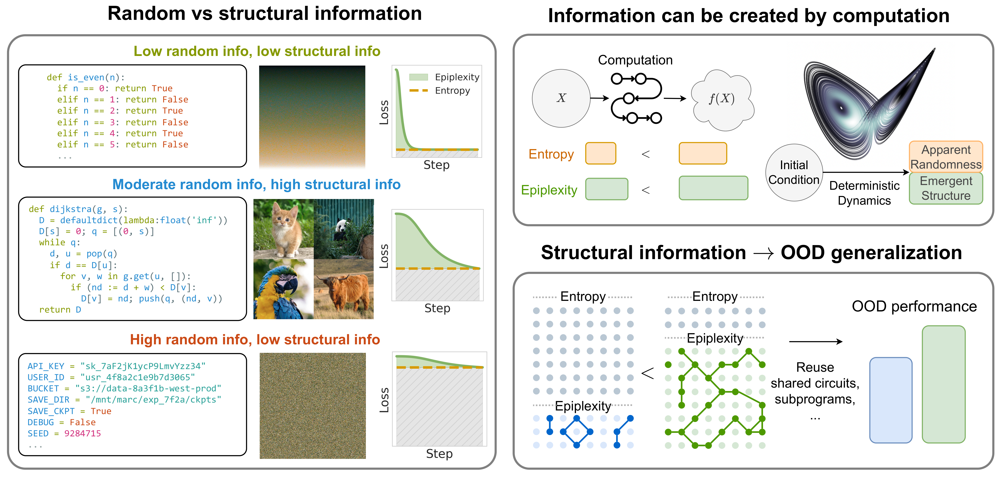

# From Entropy to Epiplexity: Rethinking Information for Computationally Bounded Intelligence

<p align="center">
  
</p>

Code for reproducing the experiments in [From Entropy to Epiplexity: Rethinking Information for Computationally Bounded Intelligence](https://arxiv.org/abs/2601.03220).

## Repository structure

```
experiments/          # Synthetic data experiments (PyTorch)
soph/                 # Training loop, model, and datasets (PyTorch)
picodo/               # Natural data experiments (JAX/Flax)
notebooks/            # Jupyter notebooks for reproducing paper figures
```

## Setup

The synthetic experiments (ECA, induction) use PyTorch. The natural data experiments (chess, OpenWebText, CIFAR-5M) use JAX. Here we create separate conda environments for each.

### PyTorch environment (synthetic experiments)

```bash
conda create -n epi python=3.10 -y
conda activate epi
pip install torch numpy wandb tqdm fire pandas plum-dispatch
```

### JAX environment (natural data experiments)

```bash
conda create -n epi_jax python=3.10 -y
conda activate epi_jax
pip install jax[cuda12] flax optax chex wandb hydra-core omegaconf tqdm numpy
```

## Synthetic experiments

All synthetic experiments are in `experiments/` and log to wandb. Each script runs a grid search over model sizes and logs results. Set `debug = True` at the top of each script for a quick single-point test run. Run from the repository root with `conda activate epi`.

| Experiment | Script | Figures | Paper |
|---|---|---|---|
| ECA 3 rules | `experiments/eca_3rules.py` | `notebooks/eca_3rules.ipynb` | Figure 3, Section 5.1 |
| ECA additional rules | `experiments/eca_rules.py` | `notebooks/eca_rules.ipynb` | Figure 2c, Section 4.3 |
| Symmetry of Information | `experiments/soi.py` | `notebooks/soi.ipynb` | Figure 4a, Section 5.2 |
| Easy induction | `experiments/induction_easy.py` | `notebooks/induction_easy.ipynb` | Figure 5, Section 5.3.1 |
| Hard induction | `experiments/induction_hard.py` | `notebooks/induction_hard.ipynb` | Figure 5, Section 5.3.2 |
| ECA emergence | `experiments/eca_emergence.py` | `notebooks/eca_emergence.ipynb` | Figure 6, Section 5.4 |

```bash
CUDA_VISIBLE_DEVICES=0 python experiments/<script>.py
```
(or for however many gpus you want to parallelize over, e.g. `CUDA_VISIBLE_DEVICES=0,1,2,3 python experiments/<script>.py`)
### Key logged quantities

Each run logs the following to wandb:

- `train_loss` / `student_loss` — per-token cross-entropy (nats) for the teacher and student
- `ema_train_loss` / `ema_student_loss` — same, but from the EMA-averaged models (preferred)
- `K_auc` — model description length via prequential coding, computed as the AUC of the training loss curve above current loss.
- `K_req` — model description length via requential coding, computed as the cumulative KL divergence from teacher to student

### Estimating epiplexity

Epiplexity is the model description length of the computed-limited MDL minimizer. In practice, this means sweeping over model sizes and training durations, then taking the Pareto frontier of model + data two-part code as a function of compute. See `notebooks/eca_3rules.ipynb` for an example of this procedure.

## Scaling law experiments (Figure 8b & 9, Section 6.2)

Analyzes published scaling law data across multiple domains (language, image, video) to estimate epiplexity and time-bounded entropy as a function of compute. No training required.

Figures: `notebooks/scaling_laws.ipynb`

## Natural data experiments

Natural data experiments use JAX and are in `picodo/`. They support single and multi-GPU training.

Activate the JAX environment before running:

```bash
conda activate epi_jax
```

### Data preparation

Run from `picodo/`:

| Dataset | Script | Description |
|---|---|---|
| `chess/` | `dataset/prepare_chess.py` | Chess (foward: moves\|board format) |
| `chess_reordered/` | `dataset/reorder.py` | Chess (reverse: board\|moves format) |
| `fen2cp/` | `dataset/prepare_fen2cp.py` | FEN to centipawn class |
| `puzzles2000/` | `dataset/prepare_puzzles.py` | Chess puzzles with rating > 2000 |
| `open/` | `dataset/prepare_open.py` | Character-level OpenWebText |
| `cifar5m/` | `dataset/prepare_cifar5m.py` | Greyscale CIFAR-5M |

### Running a single job

```bash
cd picodo
CUDA_VISIBLE_DEVICES=0 python main.py -cn chess \
  wandb_mode=online \
  wandb_project=requential \
  tag=test \
  train_student=true \
  train_teacher=true \
  teacher_ema=50 \
  student_ema=50 \
  model.N=3 \
  model.P=5 \
  ds_path=chess \
  opt.lr=2 \
  B=256 \
  model.L=512 \
  max_kl=0.1 \
  A=8 \
  opt.schedule=const \
  opt.warmup_tokens=16384000 \
  T=5000000000 \
  T_eval=1000000 \
  num_evals=50 \
  seed=0 \
  save=false
```

### Key logged quantities

- `teacher_eval_loss` / `student_eval_loss` — per-token cross-entropy (nats) on the test set
- `ema_teacher_eval_loss` / `ema_student_eval_loss` — same, but from the EMA-averaged models (preferred)
- `K(X)` — total two-part code length (Mbits), computed as AUC of training loss curve
- `K(M)` — model description length (Mbits), i.e. `K(X) - K(X|M)`
- `K(X|M)` — data given model (Mbits), i.e. `eval_loss * tokens / log(2)`
- `K(M)_req` — model description length via requential coding (Mbits), cumulative KL from teacher to student
- `distill_kl` — per-step KL divergence from teacher to student
- `down_acc` / `down_acc_ft` — downstream accuracy with linear probe / fine-tuning

### Running sweeps

Sweep configs are in `picodo/sweeps/`. To launch a sweep with one agent per GPU:

1. Create the sweep:
   ```bash
   cd picodo
   wandb sweep -p <project> sweeps/requential.yaml
   ```

2. Set the sweep ID in `launch.sh` and run:
   ```bash
   bash launch.sh
   ```

#### Pre-training (Figures 4c, 8a; Sections 5.2, 6.2)

Standard and requnetial training across model sizes on chess, OpenWebText, and CIFAR-5M.

```bash
wandb sweep -p requential sweeps/requential.yaml
```

#### Chess downstream tasks (Figure 7, Section 6.1)

Standard pre-training + downstream fine-tuning evaluation on chess puzzles and centipawn prediction.

```bash
wandb sweep -p soph_jax sweeps/chess.yaml
```

## Citation

```bibtex
@article{finzi2026epiplexity,
  title={From Entropy to Epiplexity: Rethinking Information for Computationally Bounded Intelligence},
  author={Finzi, Marc and Qiu, Shikai and Jiang, Yiding and Izmailov, Pavel and Kolter, J Zico and Wilson, Andrew Gordon},
  journal={arXiv preprint arXiv:2601.03220},
  year={2026}
}
```
